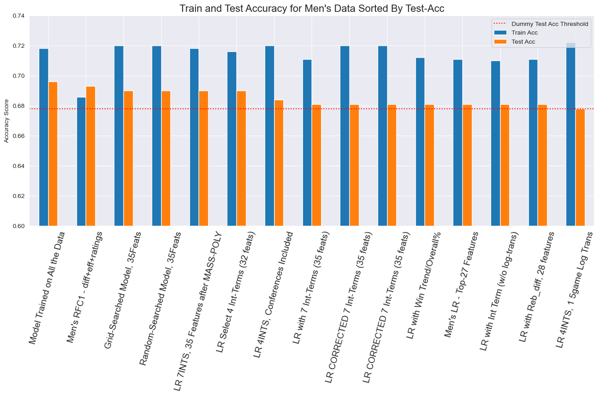

# March_Machine_Learning_Mania_2024
**Predicting 2024 NCAA Basketball Tournament Results**

From the *Kaggle* Competition: ["March Machine Learning Mania 2024"](https://www.kaggle.com/competitions/march-machine-learning-mania-2024/overview)

By: David Hartsman

[First Notebook](https://github.com/dvdhartsman/March_Machine_Learning_Mania_2024/blob/main/1_Data_Understanding_and_Aggregation.ipynb) 
    - Data Understanding, Processing, and Aggregation

[Second Notebook](https://github.com/dvdhartsman/March_Machine_Learning_Mania_2024/blob/main/2_Model_Development.ipynb) 
    - Feature Selection, Feature Engineering, Model Iterations, and Model Analysis

[Third Notebook](https://github.com/dvdhartsman/March_Machine_Learning_Mania_2024/blob/main/3_Bracket_Generation.ipynb) 
    - Creating Final Brackets Using the Pre-Trained Model from Notebook #2

### Overview

The overarching goal of this project was to develop a model capable of accurately predicting NCAA Basketball Tournament games. I took the specific avenue of developing a classification model to determine which team would win in a head-to-head match-up. I began with a broad approach. I used multiple different model types and also incorporated data from **both Men's and Women's** basketball. Later on in the modeling process, I made the decision to focus entirely on Men's basketball. The processes I used could easily be applied to the Women's data as well. 

### Data

There were 32 different CSV files that were used to curate and process the data. The game-specific data came in two different forms: **compact** and **detailed**. I opted to use the detailed data to aggregate seasons statistics. The detailed data contained more granular counting statists, such as *3 pointers attempted* and *3 pointers made* etc., as opposed to more general statistics like *winning score* and *losing score* found in the compact data. The detailed data had season information going as far back as to the season ending in the year 2003. 

I grouped the detailed data by *TeamID* and *Season* and aggregated a wide range of statistics for each team. Those details can be primarily found in the [first notebook](https://github.com/dvdhartsman/March_Machine_Learning_Mania_2024/blob/main/1_Data_Understanding_and_Aggregation.ipynb), however I did continue to create and engineer additional features throughout the modeling process in the [second notebook](https://github.com/dvdhartsman/March_Machine_Learning_Mania_2024/blob/main/2_Model_Development.ipynb). The majority of these features were numerical, however there were several categorical features included as well, such as *conference* or *coach*. 

It also bears mentioning that there was an asymmetry in the data available for Men's and Women's teams. *Coach* information was only avaialble for Men's programs, for example. There were also *Massey Rankings* which are somewhat akin to AP Rankings for teams. These were, once again, only available for the Men's programs. Other data limitations were the lack of detailed stats reaching back into the past beyond 2003. This lack of data created a situation where the number of NCAA tournament games that I could use to train my models was rather small, thereby making results a bit noisy and less accurate than hoped for.

### Evaluation

The standard to which I compared all of my model performances to was a very basic "dummy logic". This logic made predictions in each match-up by choosing the lower (better) of the two "seeds" or, if the seeds were identical, then choosing the team with the better regular season winning percentage. This strategy would be equivalent to what is referred to as picking the "Chalk", or always picking the favorite. 

As I said earlier, my initial approach to modeling was to use as many features as possible and to try several different machine learning alogrithms. The ratio of observations to features was around 5-1, roughly translating to 1000 observations to train on and 200 features to use. This is a remarkably small ratio. The results for the initial models were not terribly impressive, and many failed to even **equal** the dummy-logic.

I modified the way that my modeling data was constructed midway through the process. I, instead of using each team's season averages, created a new dataframe by calculating the difference between both teams' aggregated season statistics. Initially, this had a negative impact on model performance, however, through the process of reducing the number of features being fed to the model, I ultimately was capable of improving the model's performance. This iterative process of model creation, evaluation, feature selection, and feature engineering continued for many loops. 

### Conclusion

After much evaluation, I found that Logistic Regression produced model predictions that were generally the best. There was one occasion in the process where a Random Forest Classifier produced exceptional results, however that was an instance where the RFC test score was actually better than the training score. I determined that this outcome was likely influenced by the specific data split, and I therefore opted to continue using Logistic Regression, as its results seemed more reliable.

I do believe that there may have been a bit more performance that I could have squeezed from the data. Continuing the process of feature engineering and selection would have been painstaking, but potentially productive. I also would have liked to have more detailed information about *base-offense* or *base-defense* as well as inidividual player data. Some of these specific style combinations may have the potential to inform better predictions. 

Ultimately, the difficulty that I experienced in improving model performance is reflective of the exact reasons that March Madness captures the national spotlight year after year. It is a contest that features moments of high drama and improbable outcomes. Those moments and the pain and joy that they bring are what we all tune in to see. It would appear that those moments are also part of the irreduceable error found in this particular modeling experiment. Thank you for reading, and please explore my notebooks for further detail if you would like to!  
